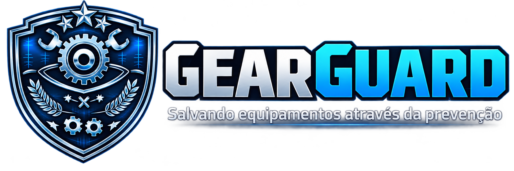

  

# GearGuard 🛡️ — Manutenção Preditiva Inteligente

Este projeto foi desenvolvido como o **Projeto Avaliativo do Módulo 1** do curso de Desenvolvimento de IA para Análise Preditiva. 
O objetivo do **GearGuard** é criar um sistema inteligente capaz de prever falhas em maquinários industriais antes que elas ocorram, reduzindo drasticamente o tempo de inatividade não planejado e custos com reparos emergenciais.

---

## Apresentação do Projeto

---

## O que o Projeto Analisa

O GearGuard utiliza dados operacionais de sensores de sensores de máquinas para identificar padrões que antecedem uma quebra. A base de dados contém as seguintes variáveis:

**udi**: Identificador único do registro.

**id_produto**: Código identificador do produto.

**tipo**: Tipo de produto (L, M ou H para níveis de qualidade/operação).

**temperatura_ar_k**: Temperatura do ambiente em Kelvin.

**temperatura_processo_k**: Temperatura do processo operacional em Kelvin.

**velocidade_rotacao_rpm**: Velocidade de rotação do equipamento.

**torque_nm**: Torque aplicado em Newton-metro.

**desgaste_ferramenta_min**: Tempo de uso acumulado da ferramenta de corte em minutos.

**falha_maquina**: Variável alvo (0 = Operação Normal, 1 = Falha Mecânica).

**falhas específicas**: Detalhamento técnico do tipo de falha (TWF, HDF, PWF, OSF, RNF).

---

## Conceitos Aplicados

**Exploração de Dados (EDA):** Análise de distribuições, detecção visual de outliers e estudo da matriz de correlação de Pearson.

**Tratamento de Dados Ausentes:** Imputação utilizando a **Média** para variáveis com distribuição normal e **Mediana** para as variáveis com muitos outliers (como velocidade e torque).

**Engenharia de Atributos (Feature Engineering):** Criação de novas métricas físicas para enriquecer o poder preditivo do modelo:

    potencia = Velocidade × Torque
    
    diferenca_temperatura = Temperatura do Processo − Temperatura do Ar
    
    desgaste_por_carga = Desgaste da Ferramenta × Torque
    
**Codificação de Categóricos:** Uso de **OneHotEncoder** para transformar a variável **tipo**.

**Tratamento de Desbalanceamento:** Aplicação da técnica **SMOTE** (Synthetic Minority Over-sampling Technique) para equilibrar a classe de falhas (que representava apenas 3.4% dos dados originais).

**Escalonamento de Atributos:** Uso do **StandardScaler** para garantir que algoritmos baseados em distância (como o KNN) não sofram influência desproporcional de escalas numéricas diferentes.

---

## Decisões Técnicas e Modelagem

Foram testados dois algoritmos de classificação em diferentes hiperparâmetros para combater o *Overfitting*:

   **K-Nearest Neighbors (KNN):** Testado com K = [3, 5, 7]. O melhor resultado foi obtido com **K=3** (Acurácia de Teste: **97.0%**).
   **Árvore de Decisão:** Testada com profundidades máximas de [3, 5, 7, Sem Limite]. O melhor resultado foi obtido com **Profundidade Máxima = 5** (Acurácia de Teste: **98.7%**).

### O Veredito Final

A **Árvore de Decisão (Profundidade Máxima = 5)** foi o modelo escolhido para o GearGuard pelas seguintes razões:

  **Maior Acurácia Global (98.7%):** Superou o KNN e a linha de base (Baseline de 96.6%).
  
  **Melhor Recall para Falhas (91.2% contra 86.8% do KNN):** A árvore deixou passar apenas 6 falhas reais não detectadas, enquanto o KNN deixou passar 9. Em cenários industriais, perder uma falha real custa muito caro.
  
  **Menos Alarmes Falsos (20 contra 52 do KNN):** Evita custos desnecessários enviando equipes de manutenção para máquinas saudáveis.
  
  **Explicabilidade:** Árvores geram regras claras e visuais de tomada de decisão (*if-else*), fundamentais para que operadores humanos confiem nos alertas de manutenção.
  
---

## Como Executar o Projeto

Para a execução deste projeto é necessário a utilização do Google Colab

Faça o Download deste projeto

Crie uma pasta e nomeie como GearGuard, coloque o projeto dentro dela e extraia todo o conteúdo

Acesse o Google Colab e faça o upload e abra o notebook PROJETO AVALIATIVO - MÓDULO 1.ipynb

No menu superior, acesse Ambiente de execução (Runtime).

Selecione Executar tudo (Run all).

Ao executar tudo, note que haverá um botão para anexar o arquivo.csv

Clique no botão "Escolher Arquivos" e selecione o arquivo "manutencao_preditiva.csv"

---

***Ferramentas e Bibliotecas Utilizadas:***

***Linguagem:*** Python 

***Manipulação de Dados:*** pandas, numpy

***Visualização Gráfica:*** matplotlib, seaborn

***Machine Learning:*** scikit-learn

***Balanceamento de Dados:*** imbalanced-learn (SMOTE)

---
***Desenvolvido por Otávio Augusto Reis Nascimento***
